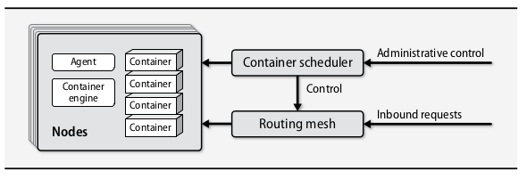
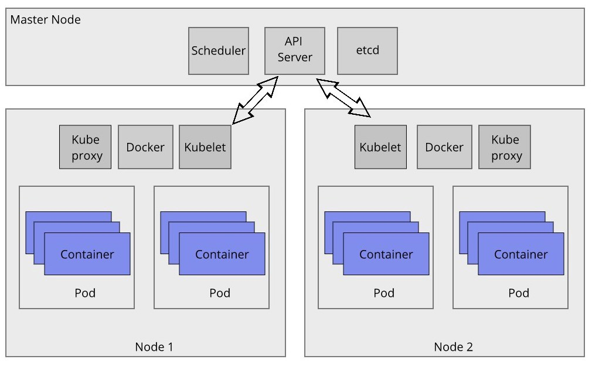

---
colorlinks:
- true
title: 
- Orkestracija konteinera - osnove
subtitle: 
- Vjezbe 11
author: 
- Srđan Daniel Simić
date: 
- 18.05.2022.
theme:
- Copenhagen

---

# Veliki potencijal konterizacije

Veliki potencijal kontenerizacije je smještanje velikog broja aplikacija na
istu host mašinu pritom izbjegavajući "konflikte"

Taj potencijal bi omogućio učinkovitije iskorištavanje servera

Docker engine odgovoran je samo **za konteinere na pojedinim host
mašinama**

# Kako rješit problem distribuiranih host mašina?

Potreban je alat za orkestraciju konteinera (planiranje/upravljanje konteinerima)

# Osnovna arhitektura 

*Preuzeto iz Unix and Linux System Administration Handbook*

# Prednosti alata za orekstraciju

Algoritam za planiranje odabire najbolji čvor ovisno o poslu

API omogućuje programima postavljanje poslova

Mogućnosti preusmjeravanja poslova na "zdrave" čvorove

Jednostavno dodavanje novih čvorova

...

# Jedan od problema kod distribuiranih konteiniziranih sustava

Mapiranje imena servisa na konteinere

Problem je poznat kao **service discovery**

# Kubernetes - "k8s"

Trenutno najpopularniji alat za orkestraciju konteinera

Ima integriranu podršku za pronalazak servisa, upravljanje tajnama, implementaciju
i autoskaliranje *pod-ova*

*Pod* sadrži jedan ili više konteinera

# Osnovni djelovi Kubernetes-a

- Zahtjeve operatora
- Postavljanje poslova
- Pračenje stanja 
- Agenta koji se izvršava na svim čvorovima
- Usmjeravanje nadolazećih zahtjeva 

# Arhitektura Kubernetes-a

*Preuzeto s [Web-a](https://architecture-database.blogspot.com/2019/04/basic-concepts-of-kubernetes.html)*
